# A RE-DESIGN OF THE COMPUTER SCIENCE DEPARTMENT'S WEBSITE.
---
## This is a redesign of University of Ghana's Computer Science Department's website.
Welcome to our comprehensive Computer Science Department Information Hub! Our website is dedicated to providing visitors with all the essential information related to the Computer Science Department. Whether you are a prospective student exploring courses, an applicant seeking admission details, or a current student looking for resources, you'll find everything you need right here.

## Table of Content
1. Project Introduction
2. setup Instructions
3. Author Information
4. Screenshots of Pages
5. Learnings from Project

## Project Introduction
- Courses: Explore our diverse range of courses, including detailed descriptions, prerequisites, and curriculum outlines.

- Admissions: Get insights into our admission process, requirements, and application procedures. We aim to make the admission journey transparent and accessible.

- Faculty: Meet our esteemed faculty members, each with unique expertise and contributions to the field of computer science.

- Student Resources: Access a wealth of resources designed to support your academic journey, including study materials, research opportunities, and extracurricular activities.
  
- About Us: Learn more about the Computer Science Department, our mission, vision, and the values that guide our academic community.

- Contact Information: Find essential contact details for key department personnel, including academic advisors and administrative staff.

- News and Information: Stay updated on the latest news, events, and announcements from the Computer Science Department.

- Research: Explore our ongoing research projects, publications, and the groundbreaking work of our faculty and students.

## How to Use the Website
**Navigate through the menu or use the search bar to find specific information. The website is designed to be user-friendly, ensuring a seamless experience for all visitors.**

## Contributing
**If you have suggestions, corrections, or additional information you'd like to see on the website, feel free to contribute. Kindly ontact me at *raphmens2018@gmail.com*.**

## Setup Instructions
### Cloning the Project:
- Install Git:
Make sure Git is installed on your machine. You can download it from Git's official website.

- Navigate to the Desired Directory:
Open a terminal or command prompt and navigate to the directory where you want to clone the project.

- Clone the Repository:
Use the git clone command to clone the repository
'git clone <repositoryURL>'. You must replace <repositoryURL> with the actual URL of the git repository.

### Setting Up the Project:
Navigate to the Project Directory:
Move into the cloned project directory:
Use 'cd project_name'to navigate to its location

### Install Dependencies:
Depending on the project, you might need to install dependencies. Commonly, this involves using a package manager. For example, if the project uses Node.js, you might run:
'npm install'

### Configuration:
Some projects require configuration files (e.g., .env files, configuration files for databases). Look for any provided configuration files and make sure to set them up appropriately.

### Build the Project (if applicable):
Certain projects, especially those using frameworks, may require a build step. This might involve running commands like:
'npm run build'

### Start the Project:
Finally, start the project. This could involve running a server, starting a development environment, or running specific scripts:
'npm run'

## Author Information
**Name: Raphael Ayeh Mensah**
**ID: 11016071**

## Screenshots of Pages
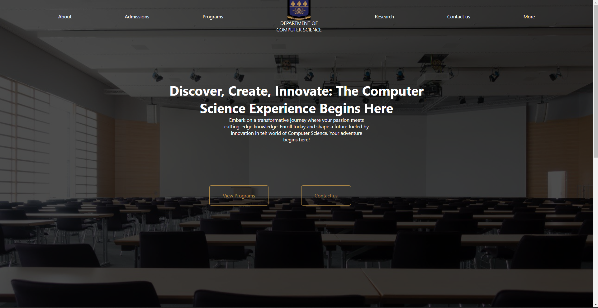

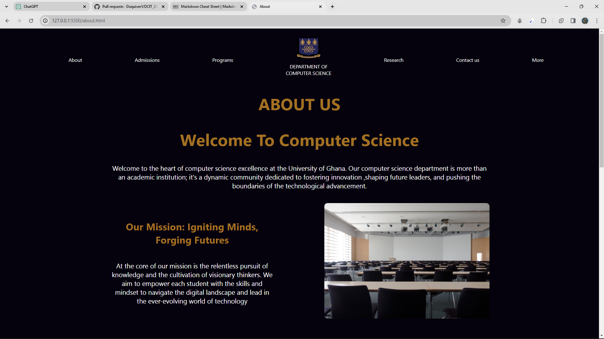
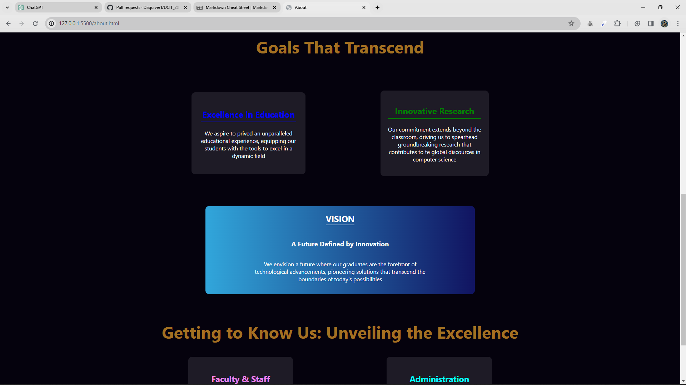
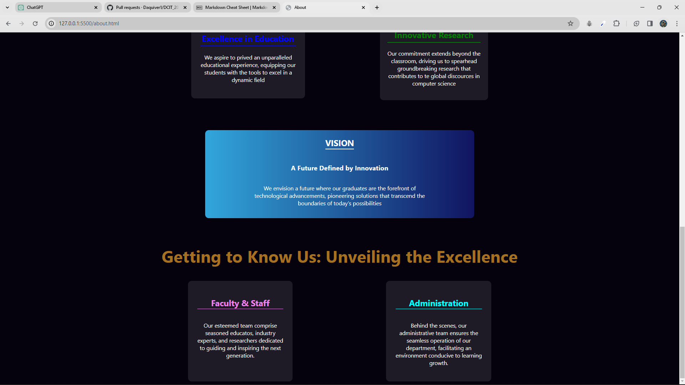
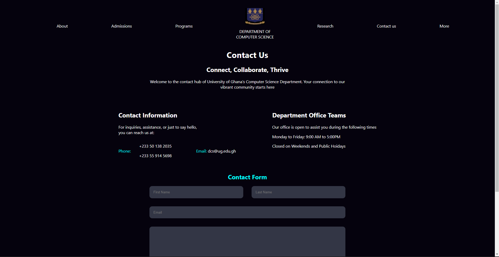
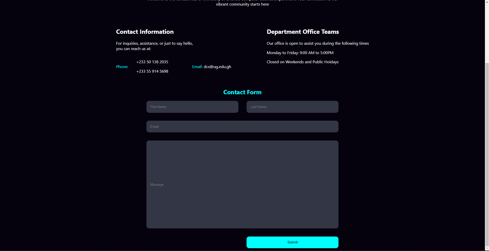
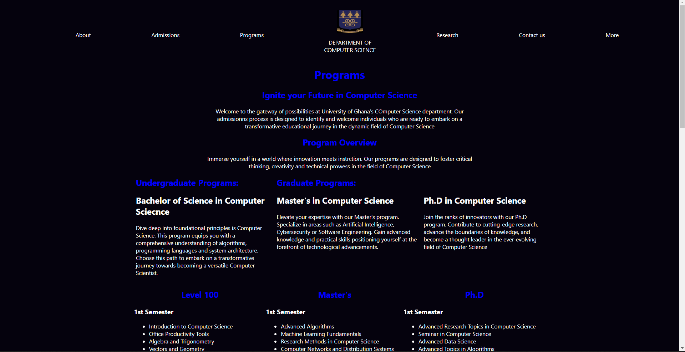
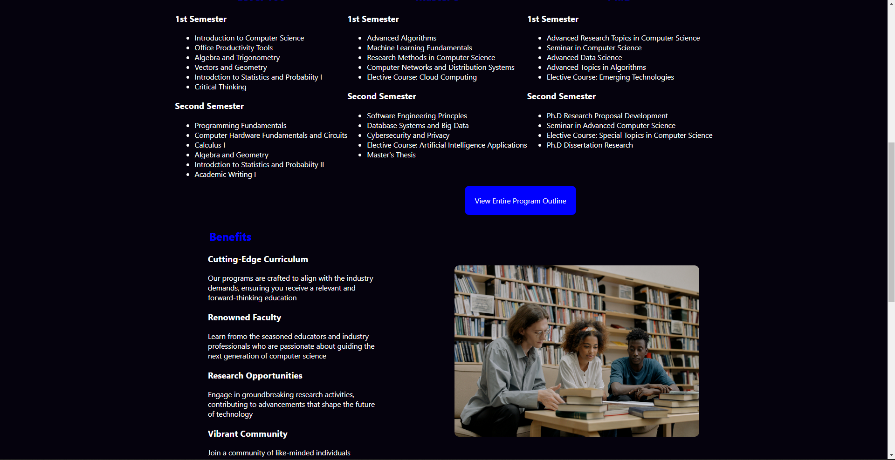
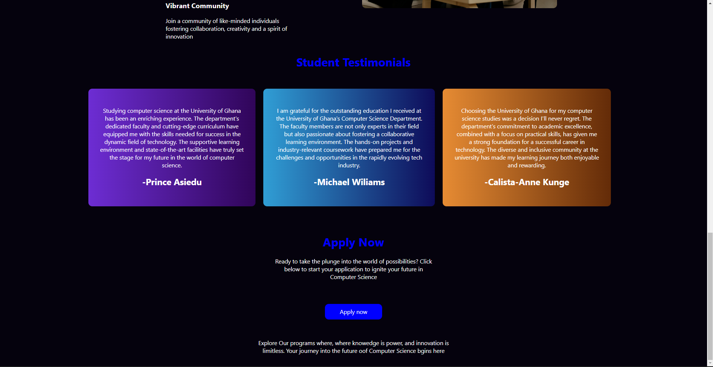
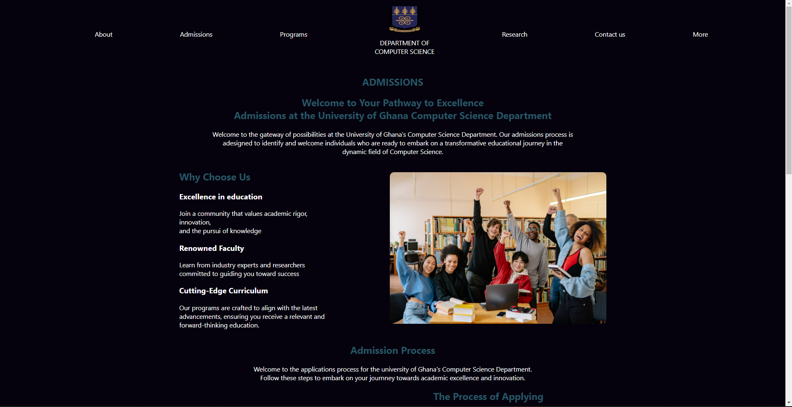
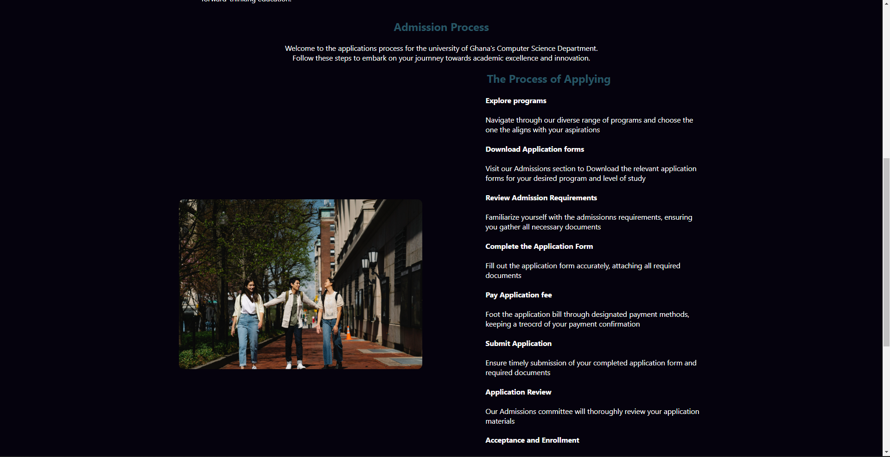
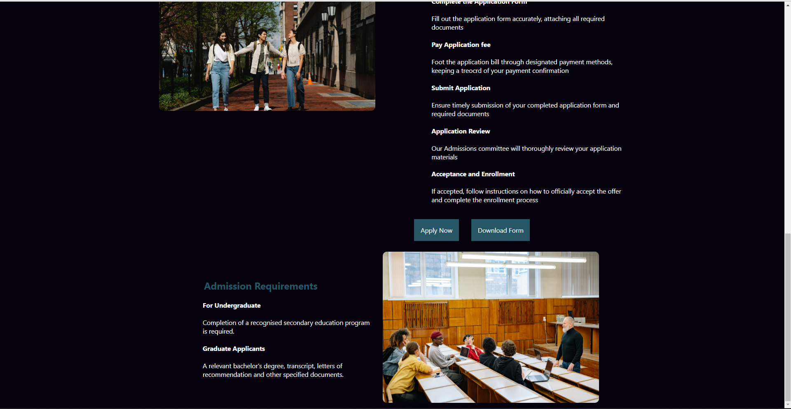

## Learnings from Project.
